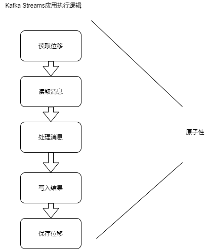

## 什么是流处理平台
Streaming System 是处理无限数据集的数据处理引擎，而流处理是与批处理相对应的。

无限数据是指数据永远没有尽头，流处理平台是专门处理这种数据集的系统或框架。

长久以来，流处理给人的印象通常是低延迟，但是结果不准确。每来一条消息，它都能计算一次结果，但由于它处理的大多是
无界数据，可能永远也不会有结果。因此，在流处理中我们很难精确描述结果何时是准确的。理论上，流处理的计算结果会
不断的逼近精确结果。但是，批处理恰好相反，它能提供精确的计算结果，但往往时延很高。

因此，业界的大神扬长避短，将两者结合在一起。一方面利用流处理快速给出结果；另一方面依托批处理实现数据一致性。这就是
所谓的Lambda 架构。 
## Kafka Streams 的特色
相比其他流处理平台，Kafka Streams的最大特色是他不是一个平台，至少不是一个具备完整功能的平台。比如其他框架
中自带的调度器和资源管理器，就是Kafka Streams不提供的。kafka 官网中明确定义kafka Streams 是一个Java客户端
。你可以使用这个库构建高伸缩性 高弹性 高容错性的分布式应用以及微服务。

使用kafka Streams API 构建的应用就是一个普通的Java应用程序。你可以选择任何熟悉的技术或框架对其进行编译 打包 部署 上线
## Kafka Streams与其他框架的差异
### 应用部署
首先，我们从流处理应用部署上线方式上对kafka Streams进行区分

Kafka Streams 应用需要开发人员自行打包和部署，甚至可以将Kafka Streams 应用嵌入到其他Java应用中。
因此，作为开发者，除了需要开发代码之外，还需要自行管理Kafka Streams 应用的生命周期，要么将其打包成独立的
jar包运行，要么将流处理逻辑嵌入到微服务中，开发给其他服务调用。相反，其他流处理平台则提供完整的部署方案。
### 上下游数据源
kafka Streams 目前只支持从kafka读数据以及向kafka写数据。
### 协调方式
在分布式协调方面，kafka Streams应用依赖与kafka集群提供的协调功能，来提供高容错性和高伸缩性。kafka Streams
应用底层使用了消费者组机制来实现任意的流处理扩缩容。应用的每个实例或节点，本质上都是相同消费者组下的独立消费者，
彼此互不影响。他们之间协调工作，由Kafka集群broker上对应的协调者组件完成。每当有实例增加或退出时，协调者自动
感知并重新分配负载。
### 消息语义保障

