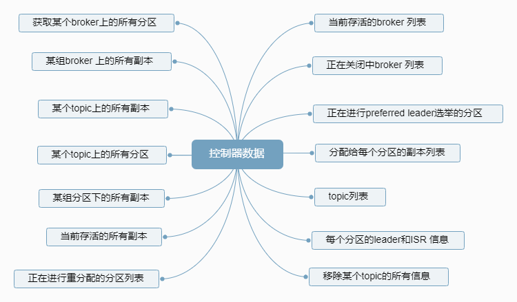

## Kafka Controller
控制器组件时kafka 的核心组件。它的主要作用是在Apache Zookeeper 的帮助下管理和协调整个Kafka 集群。集群中任意一台
broker 都能充当控制器的角色，但是在运行过程中，只能有一个broker 成为控制器，行使其管理和协调的职责。就是说，
在正常运转的kafka 集群中，在任一时刻都有且仅有一个控制器。可以借助activeController指标实时监控控制器的存活状态。
## 控制器是如何被选出来的？
kafka集群中，每台broker 都能充当控制器的角色，那么，当集群启动时，kafka是怎么确定控制器是哪台broker？

broker 在启动时，会尝试去Zookeeper 中创建/controller 节点。kafka 当前选举控制器的规则是：第一个成功创建
/controller节点的broker 会被指定为控制器。
## 控制器是做什么的？
我们经常说，控制器是起协调作用的组件，那么，这里的协调作用到底是指什么？
### 1. 主题管理(创建 删除 增加分区)
这里的主题管理，就是指控制器帮助我们完成对kafka 主题的创建 删除 以及分区增加的操作。换句话说，当我们在执行
kafka-topics(进行所有的主题管理操作) 脚本时，大部分的后台工作都是控制器来完成的。
### 2. 分区重分配
分区重分配是指 kafka-reassign-partitions 脚本提供的对已有主题分区进行细粒度的分配功能，用于执行
分区副本迁移以及副本文件路径迁移,这部分功能也是由控制器实现的。
### 3. Preferred 领导者选举
Preferred 领导者选举主要是kafka 为了避免部分broker 负载过重而提供的一种换leader 方案。
### 4. 集群成员管理（新增broker broker 主动关闭 broker 宕机）
包括主动检测新增broker broker 主动关闭及被动宕机。
### 5. 数据服务
向其他broker 提供数据服务。控制器上保存了最全的集群元数据信息，其他所有broker 会定期接收控制器发来的元数据更新请求，
从而更新其内存中的缓存数据。

 
## 控制器故障转移（failover）
kafka在运行过程中，只能又一台broker 充当控制器的角色，那么就存在单点失效的风险。kafka应对这种
风险的办法是 为控制器提供故障转移功能，也就是failover。

故障转移是指 当运行中的控制器突然宕机或意外中止时，kafka 能快速的感知到，并立即启用备用控制器
来代替之前失效的控制器.这个过程称为failover.该过程是自动完成,无需手动干预.
## 当控制器组件出现问题
当控制器组件出现问题时,比如主题无法删除 或者重分区hang住,可以不用重启kafka broker 或控制器
.一个快速简单的办法是: 在Zookeeper中手动删除/controller 节点.这样即可以触发控制器的重选举,
又可以避免重启broker 导致的消息处理中断.
